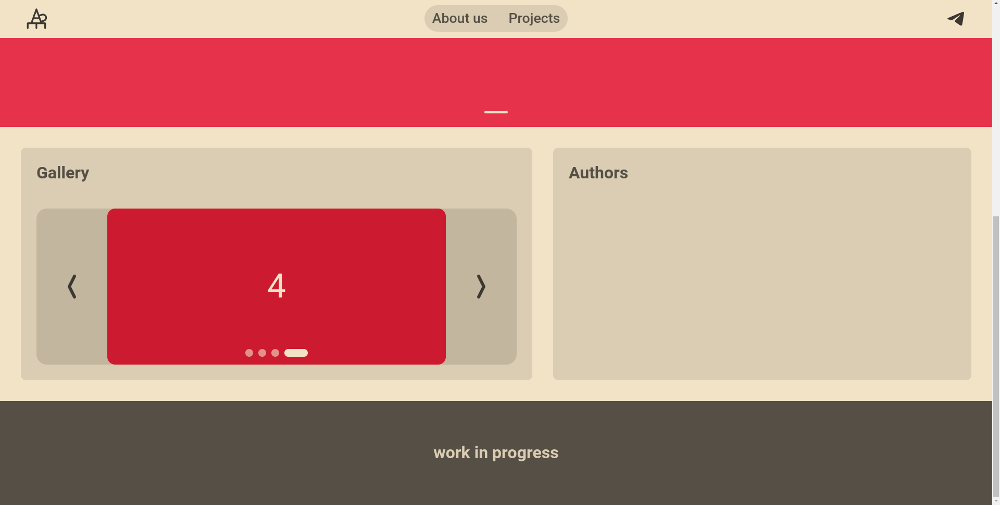

# DSS (Doryan Simple Slider)


Slider on native javascript and contains nothing extra.

## This is a very simple to use slider.

# How to use?

1. Create a construction in the ```<body>...</body>``` that looks like this:

```
<div class="YourSliderName">
    <div>1</div>
    <div>2</div>
    <div>3</div>
    <div>4</div>
</div>
```
### WARNING


In case of using two or more sliders, please don't use the same name for all the sliders on the site or you will end up with a semi-non-working slider

To avoid the problem described above, do as indicated in the code below:
```
...
        <div class="YourSliderName_1">
            <div>1</div>
            <div>2</div>
            <div>3</div>
            <div>4</div>
        </div>

        <div class="YourSliderName_2">
            <div>1</div>
            <div>2</div>
            <div>3</div>
            <div>4</div>
            <div>5</div>
            <div>6</div>
            <div>7</div>
            <div>8</div>
        </div>

    </body>
    <script>
    
        DSS_start(".YourSliderName_1",
            
            yourSettings1 = {

                autoPlaySlider: true,
                autoPlayDelay: 5000,
                autoPlayDirrection: "right",
                arrows: true,
                dots: true,
                dotsEffect: "dot-pull",
                endlessSlider: true,
                transition: "ease-in-out",
                speedAnimation: 500,

            }

        );

        DSS_start(".YourSliderName_2",
            
            yourSettings2 = {

                autoPlaySlider: true,
                autoPlayDelay: 1000,
                autoPlayDirrection: "left",
                arrows: true,
                dots: true,
                dotsEffect: "dot-pull",
                endlessSlider: true,
                transition: "ease-in-out",
                speedAnimation: 350,

            }

        );

    </script>
</html>
```
You can not configure the slider, but just call the function where you passed the slider class name:

```
...
        DSS_start(".YourSliderName");
    </script>
</html>
```

2. Insert the line with the JavaScript file in the ```<head>...</head>``` tags:

```
<script type="text/javascript" src="ds_slider/ds_slider.js"></script>
```
as shown in the code:

```
<html>
    <head>
        ...
        <script type="text/javascript" src="ds_slider/ds_slider.js"></script>
    </head>
    <body>
        <div class="YourSliderName">
            <div>1</div>
            <div>2</div>
            <div>3</div>
            <div>4</div>
        </div>
    </body>
    <script>
        DSS_start(".YourSliderName");
    </script>
</html>
```
and only then after ```</body>``` tag insert the ```<script>``` tag, where you call the function to run the slider, like in the example above.

3. Configure the slider in the CSS file:

```
:root{
    --width: 640px;     //default width
    --height: 400px;    //default height
    --dots-size: 15px;  //default size a dots
}
```
4. Configure the slider to your liking:
```
settings = {

    autoPlaySlider: true,        // AutoPlay toggle
    autoPlayDelay: 1000,         // AutoPlay delay
    autoPlayDirrection: "left",  // AutoPlay dirrection
    arrows: true,                // arrows toggle
    dots: true,                  // dots, which are responsible for the indication of the active slide
    dotsEffect: "dot-default",   // appearance of dots
    endlessSlider: true,         // endless slider toggle
    transition: "ease-in-out",   // animation type for the slider scrolling
    speedAnimation: 350,         // speed of scrolling animation

}
```
Then enter all the settings into the slider function, as shown in the example below:
```
        ...
    </body>
    <script>
        DSS_start(".YourSliderName",
        
            exampleSettings = {

                autoPlaySlider: true,
                autoPlayDelay: 1000,
                autoPlayDirrection: "left",
                arrows: true,
                dots: true,
                dotsEffect: "dot-default",
                endlessSlider: true,
                transition: "ease-in-out",
                speedAnimation: 350,

            }
        
        );
    </script>
</html>
```
5. All ready to go

## At the moment the slider is built into my website and works great:



I'll be working on the AutoPlay option soon

## What on stady "work in progress"?

- [ ] Dots navigation
- [ ] Swipes on smartphones
- [X] AutoPlay

## Did you find the bug? Make sure to [leave an issue](https://github.com/doryan04/DSS/issues/new) in case of any problems.

### Check out @tfk004 on Telegram. https://t.me/doryanProjects
