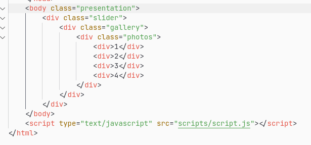

# DSS (Doryan Simple Slider)


Slider on native javascript and contains nothing extra.

## This is a very simple to use slider.

# How to use?

1. Create a construction in the "body" that looks like this:

```
<div class="slider">
    <div class="gallery">
        <div class="photos">
            <div>1</div>
            <div>2</div>
            <div>3</div>
            <div>4</div>
            <div>...</div>
            <div>n</div>
        </div>
    </div>
</div>
```

2. Append in HTML document after tags ```<bodу>...</bodу>``` script tag:

```
<script type="text/javascript" src="scripts/script.js"></script>
```
as shown in the picture:



3. Configure the slider in the CSS file:

```
:root{
    --width: 640px;     //default width
    --height: 400px;    //default height
    --dots-size: 15px;  //default size a dots
}
```
4. Configure the slider in the js file:
```
const settings = {
    transition: "ease-in-out", // default transition for animation
    dots: "on",                // default toggle value
    speedAnimation: 500,       // default speed animation
}
```
5. All ready to go

## What doesn't works?

1. Support two or more sliders
2. Dots navigation
3. Swipes on smartphones

## Did you find the bug? Make sure to [leave an issue](https://github.com/doryan04/DSS/issues/new) in case of any problems.

### Check out @tfk004 on Telegram. https://t.me/tfk004
